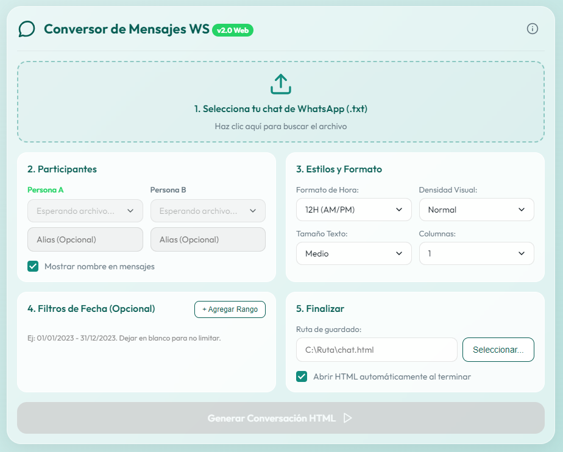

# Conversor de Mensajes de WhatsApp 💬✨

## ¿Qué es esta aplicación?

El **Conversor de Mensajes de WhatsApp** es una herramienta de escritorio diseñada para transformar los archivos de texto sin formato (`.txt`) exportados de tus chats de WhatsApp en archivos HTML visualmente atractivos y fáciles de leer. El resultado simula la apariencia real de un chat, ofreciendo opciones de personalización como el tamaño de texto, el formato de la hora, e incluso aplicar filtros de fechas. ¡Es ideal para guardar y leer tus historiales de conversación de una manera estética y ordenada!

## ¿Cómo funciona?

La aplicación es un programa de escritorio construido en **Python**. En lugar de usar interfaces gráficas de usuario tradicionales, aprovecha las tecnologías web modernas (**HTML, CSS y JavaScript**) para su interfaz gráfica gracias a la librería **[Eel](https://github.com/python-eel/Eel)**.

1. **Frontend (Interfaz):** Proporciona un entorno intuitivo en el navegador local donde el usuario puede cargar su archivo, seleccionar los participantes, y elegir preferencias (alias, colores, densidad de la interfaz, etc.).
2. **Backend (Python):** Al recibir las instrucciones, el backend utiliza expresiones regulares avanzadas (`regex`) para leer el archivo `.txt` de WhatsApp, depurar el contenido irrelevante o multimedia omitida, extraer los mensajes, fechas y horas, y ensamblar dinámicamente un archivo `.html` final con base a las preferencias definidas por el usuario.

## Datos de Desarrollo

- **Propósito de desarrollo:** Este es un proyecto desarrollado con **fines estrictamente personales**, buscando encontrar una solución más amigable para leer, archivar, visualizar e imprimir conversaciones largas.
- **Tecnologías integradas:** Python (Regex, Tkinter FileDialog), HTML5, CSS3, JavaScript.
- **Asistencia de IA:** Este software, tanto el código Python como su interfaz web y estilos visuales, se generó con la asistencia de Inteligencia Artificial utilizando **Antigravity** (herramienta de codificación) impulsado por modelos **Gemini** de Google.

## Reconocimientos y Autoría

El proyecto es de uso libre, pero si decides utilizarlo, modificarlo o basarte en él para alguna de tus creaciones, **se agradece inmensamente que se cite al desarrollador y autor original**.

👨‍💻 **Autor:** Firo  
✉️ **Email:** firogv96@outlook.com

---

_¡Gracias por echarle un vistazo a este proyecto!_
